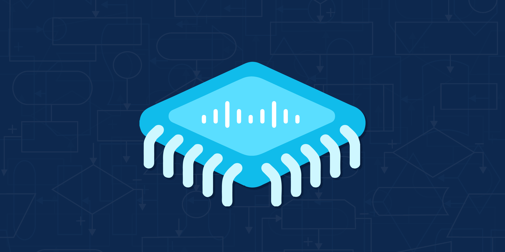

<!--  OWL IMAGE

  

-->

<!-- Banner Image -->

---

 
<h1>
  
  Hii, I'm TEJAS!
</h1>

<!-- Introduction -->
 

*A passionate FPGA Design Engineer burning FPGAs to build a sustainable future*

 

  I’m an FPGA and Digital Design Engineer with a deep love for hardware design, RTL development, and system-level debugging.

  I work on everything from low-level Verilog to complex DSP and embedded integrations, always curious to push the boundaries of reconfigurable computing.

 

  

    🔧
    &nbsp;Lifelong learner and hardware tinkerer
  

  

    🚀
    &nbsp;Currently exploring the boundaries of FPGA technology
  

  

    💻
    &nbsp;Visit my <a href="https://github.com/tejasgolhar2">GitHub</a> for projects and experiments
  

 

## 🛠️ Skills & Tools

**Languages & HDLs**  
Verilog (IEEE 1364) • SystemVerilog (IEEE 1800-2017) • VHDL • TCL 8 • Python 3 • C • C++

**Tools & IDEs**  
Vivado Design Suite • Xilinx ISE • ModelSim • Intel Quartus Prime • Vitis HLS •  
Xilinx XSim • Icarus Verilog • Verilator

 

## 🚀 Highlight Projects

<table>
  <tr>
    <td width="48%">
      
    </td>
    <td width="48%">
      
    </td>
  </tr>
</table>

## 📊 GitHub Stats

<table>
  <tr>
    <td width="48%">
      
    </td>
    <td width="48%">
      
    </td>
  </tr>
</table>

 

<!--

  

---

## 📈 Contribution Graph

  

---

## 🌟 Quote of the Day

  

-->

## 🤝 Connect with me

  <!-- Email -->
  
  <!-- LinkedIn -->
  
  <!-- GitHub -->
  
  <!-- Twitter -->
  

  

